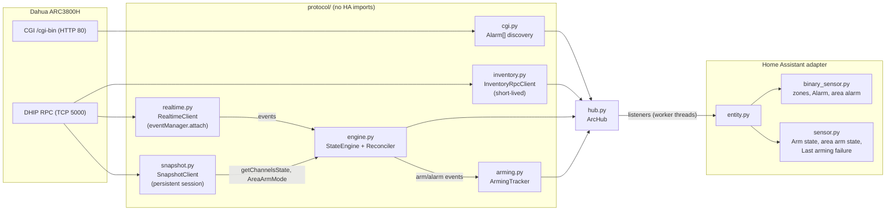
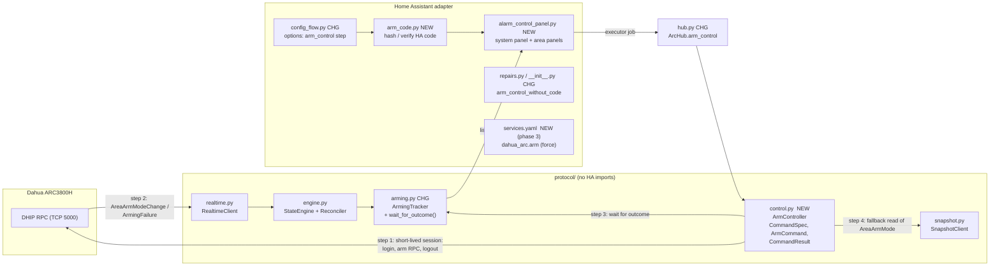
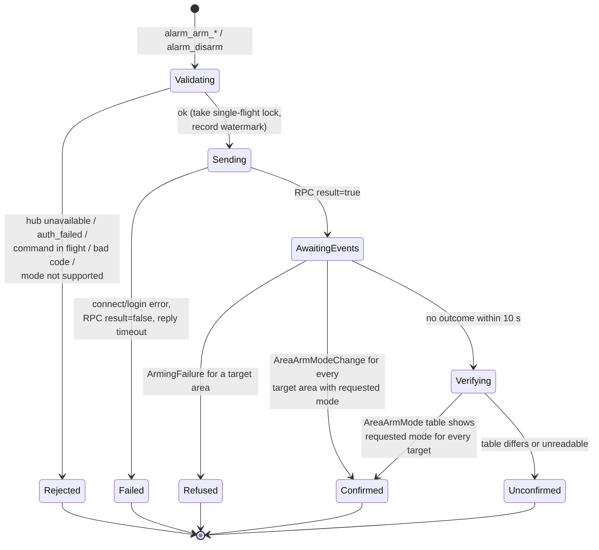
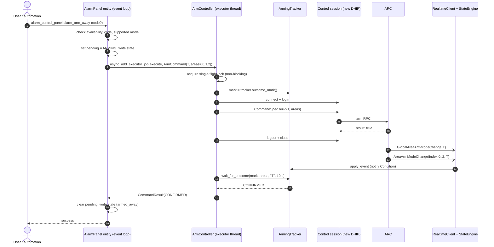
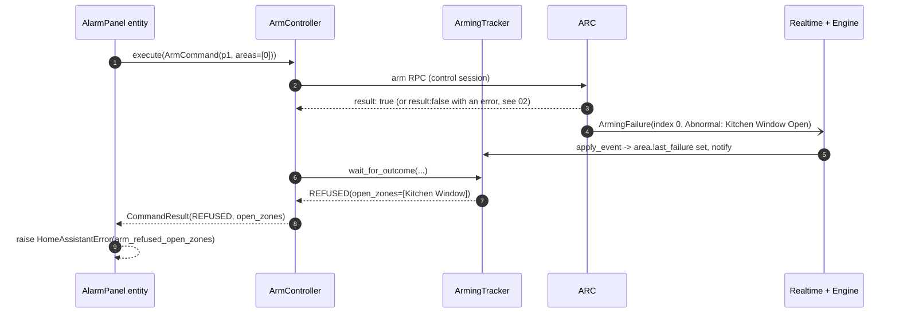
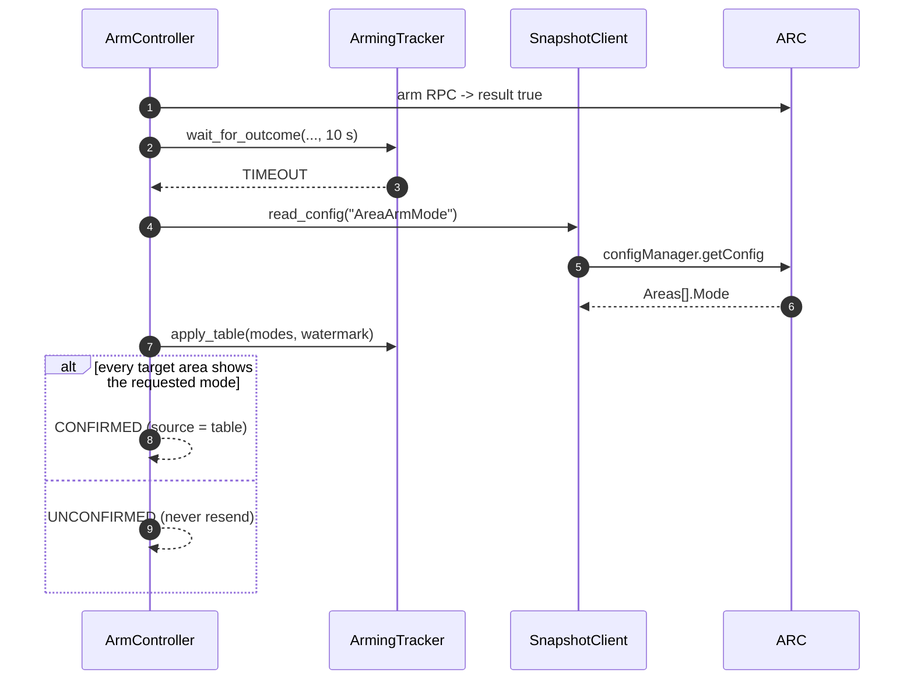

# 01 — Architecture

## 1. Today: a read-only pipeline



What matters for the write path:

- `ArmingTracker` already knows each area's arm state (from events and from
  the `AreaArmMode` table), each area's alarm state, and the last arming
  failure with its open zones.
- Events reach the tracker on the engine's processor thread. The tracker
  debounces HA notifications by about 1 s (`NOTIFY_QUIET_SECONDS`) so that a
  burst of per-area events does not pass through a transient "mixed" state.
- The only existing write is research mode's detector test
  (`research/detector_test.py`), which opens its **own short-lived DHIP
  session** per command. The arm path follows the same pattern.

## 2. Target: add one controlled write path

New and changed components are marked **NEW** or **CHG**.



### Component responsibilities

| Component | Layer | Owns | Must not |
|---|---|---|---|
| `protocol/control.py` **NEW** | protocol | `CommandSpec` (verified RPC method + param builder + reply parser), `ArmCommand`, `CommandResult`, `ArmController` (single-flight lock, session lifecycle, confirmation wait, fallback table read, command history for diagnostics) | import `homeassistant`; retry a sent command; log secrets |
| `protocol/arming.py` **CHG** | protocol | Condition variable signalled on every arm event, failure and table apply; `wait_for_outcome(...)`; per-area zone membership for "open zones now" | change existing state semantics or notification debouncing |
| `protocol/inventory.py` **CHG** | protocol | `extract_area_zones()`: area index → zone `Alarm[]` indexes (from `AlarmSubSystem[].Zone`) | — |
| `hub.py` **CHG** | glue | Constructs `ArmController` only when `enable_arm_control` is on; routes `LoginError` to `_handle_auth_failure`; exposes `arm_control` (or `None`) | construct it in read-only mode |
| `alarm_control_panel.py` **NEW** | HA | Entities, state mapping, code check, translating `CommandResult` into `HomeAssistantError` | talk to sockets directly |
| `arm_code.py` **NEW** | HA | PBKDF2 hash/verify with constant-time compare | store or log the plain code |
| `config_flow.py` **CHG** | HA | Options step `arm_control` | echo the stored code hash to the browser |

`protocol/control.py` is deliberately separate from `arming.py`. `arming.py`
stays a pure state tracker fed by events; `control.py` is the only module that
can write to the ARC's arm state. A reviewer can then audit every write by
reading one file.

## 3. Transport choice

| Option | Verdict | Why |
|---|---|---|
| Realtime session | **Rejected** | `_read_events_forever` owns `recv`; a command reply would be consumed as an event frame. Interleaving replies with the event stream is fragile. |
| Snapshot session | Rejected (fallback reads only) | Its lock is held for snapshots and, in research mode, file downloads of up to 20 s. A disarm must not queue behind a PIRCam download. A command failure would also tear down the session the reconciler depends on. |
| **Short-lived control session per command** | **Chosen** | Same pattern as the detector test and `InventoryRpcClient`. Failure is isolated. Login adds roughly 0.3–1 s, which is acceptable for a human-initiated action. No extra keepalive thread. |
| Persistent control session | Rejected for now | Adds a thread and a keepalive for an action used a few times a day. Revisit only if login latency proves to be a problem on hardware. |

The control session must:

1. Refuse to open if `hub.auth_failed` is set. Never trigger extra logins
   against a rejected password, because that can lock the ARC account.
2. Use a timeout of 12 s for connect and login and 10 s for the command reply.
3. Log out (`global.logout`, if the firmware supports it) and always close the socket in `finally`.
4. On `LoginError`, call the hub's `_handle_auth_failure` (which starts
   reauthentication) and return a `CommandResult` with `outcome=AUTH_FAILED`.

## 4. Command lifecycle

### 4.1 State machine (one command)



Outcome → what the HA action does:

| Outcome | Action result | Entity afterwards |
|---|---|---|
| `CONFIRMED` | returns normally | shows the new state (from the tracker) |
| `REFUSED` | raises `HomeAssistantError` "Arming refused: open zones …" | previous state; `last_arming_failure` attributes populated |
| `FAILED` | raises `HomeAssistantError` with the ARC error code/message | previous state |
| `UNCONFIRMED` | raises `HomeAssistantError` "The ARC accepted the command but did not confirm it" | whatever the tracker says. **No retry.** |
| `REJECTED` | raises `ServiceValidationError` (user error) or `HomeAssistantError` | unchanged |
| `AUTH_FAILED` | raises `HomeAssistantError`; reauth flow already started | unavailable |

### 4.2 Sequence: arm Away, confirmed by events



### 4.3 Sequence: arm refused because a zone is open



Phase 0 must establish whether a refused arm comes back as an RPC error, an
`ArmingFailure` event, or both. The controller treats either as `REFUSED`.

### 4.4 Sequence: no event arrives (missed or delayed)



## 5. Threading and synchronisation

| Thread | Runs | Touches |
|---|---|---|
| HA event loop | entity methods, state writes | reads tracker under its lock; sets the entity's own `pending` flag |
| HA executor | `ArmController.execute()` (blocking) | control socket, tracker condition wait, snapshot `read_config` |
| `dahua-arc-realtime` | event read loop | enqueues events |
| engine processor | `StateEngine._apply_event` → `ArmingTracker.apply_event` | tracker state; **signals the condition** |
| tracker timer | debounced `_fire` → hub `_notify_arm` | HA listeners |

Rules:

- `ArmingTracker` gains `self._changed = threading.Condition(self.lock)`.
  `apply_event`, `apply_table`, `invalidate` call `notify_all()` while holding
  the lock. The condition fires **immediately**. The 1 s HA debounce is
  unchanged and does not delay confirmation.
- The tracker keeps monotonically increasing counters: the existing
  `event_sequence` (arm changes) plus a new `failure_sequence` (arm failures).
  `outcome_mark()` returns both. `wait_for_outcome()` only counts events with a
  sequence greater than the mark, so a stale failure from earlier never refuses
  a new command.
- `ArmController` holds a `threading.Lock` acquired **non-blocking**. A second
  command while one is in flight is rejected at once (`REJECTED: busy`). It does
  not queue: a queued disarm behind a slow arm is surprising and unsafe.
- A realtime reconnect during the wait (`invalidate()`) does not cancel the
  wait. The reconnect's table read (`apply_table`) resolves it, or the fallback
  read does.
- `hub.stop()` sets a stop event that `wait_for_outcome` also observes. Unload
  must never hang on a pending command; the result is `FAILED: unloading`.

## 6. Data model (protocol layer)

Names are suggestions. The shapes are what matter.

```text
ArmMode         = Literal["D", "p1", "T", "p2"]           # ARC raw codes

ArmCommand
  mode: ArmMode
  areas: tuple[int, ...]        # zero-based AlarmSubSystem indexes; sorted, non-empty
  force: bool = False           # phase 3 only
  origin: str                   # "ha:<context_id>" — kept for diagnostics, never sent

CommandOutcome  = Enum(CONFIRMED, REFUSED, FAILED, UNCONFIRMED, REJECTED, AUTH_FAILED)

CommandResult
  outcome: CommandOutcome
  command: ArmCommand
  started_at / finished_at: str
  confirmed_by: Literal["event", "table"] | None
  rpc_error_code: int | None
  rpc_error_message: str | None
  open_zones: list[dict]        # same shape as parse_abnormal_zones()
  reason: str | None            # REJECTED / FAILED detail key, e.g. "busy", "unavailable"

CommandSpec                     # the single place that encodes the ARC's RPC (see 02)
  method: str
  needs_instance: bool          # factory.instance / destroy dance, like detector_test
  build_params(cmd, password) -> dict
  parse_reply(reply) -> (ok: bool, error_code, error_message, open_zones)
```

`ArmController.history` keeps the last 20 `CommandResult`s for diagnostics.
Parameters are redacted: no password and no code.

## 7. Safety properties

| Property | How it is guaranteed | Test |
|---|---|---|
| Read-only unless opted in | `ArmController` is constructed only when the option is on; the panel platform returns early otherwise | HA test: option off → no `alarm_control_panel` entities and `fake_arc.calls` ⊆ read-only allowlist |
| No write outside a user/automation action | Only `ArmController.execute` calls `CommandSpec.method`; nothing else imports it | grep-style unit test: the method string appears only in `control.py` |
| No double execution | No retry after send; single-flight lock | controller test: RPC timeout → `FAILED`, exactly one RPC in `fake_arc.calls` |
| No stale success | Confirmation counts only events after the mark | tracker test with a pre-existing failure |
| No action on stale state | Panels unavailable while realtime is down; controller re-checks `hub.available` | HA test |
| No account lockout | Respect `hub.auth_failed`; route `LoginError` to the existing handler | controller test |
| No secret leakage | Redaction in history and diagnostics; code stored hashed | diagnostics test searches for the plain password and code |
