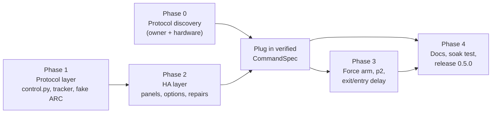

# 05 — Implementation plan

Five phases. Each ends in a PR that passes the full CI (compile, Ruff, pytest
with the coverage floor, HA tests, Hassfest, HACS, package check) and leaves the
integration releasable. Phases 1 and 2 can run while Phase 0 waits on the
owner's hardware time, because they are built against `CommandSpec` and the
fake ARC.

## Phase 0: protocol discovery

See 02 §4 for the full procedure.

| Task | Who | Output |
|---|---|---|
| 0.1 Pull method lists from existing diagnostics | owner downloads, agent reads | candidate methods |
| 0.2 PR: add `methodSignature`/`methodHelp` for candidate setters to `collect_arm_state_probe` | agent | small read-only PR + test |
| 0.3 Capture a real arm from the web UI or ConfigTool | owner | sanitized fixtures |
| 0.4 PR: `scripts/arm_probe.py` (standalone, not shipped) | agent | script; `check_package.py` asserts it is not in the zip |
| 0.4 Run the T1–T8 trial matrix | owner, at the panel | evidence table + fixtures in `tests/fixtures/arm_control/` |

**Exit:** the evidence table in 02 §4 is filled for T1–T6 at minimum.

## Phase 1: protocol layer (no HA code)

### Files

| File | Change |
|---|---|
| `protocol/control.py` | **new**. `ArmMode`, `ArmCommand`, `CommandOutcome`, `CommandResult`, `CommandSpec`, `FAKE_COMMAND_SPEC`, `ArmController` |
| `protocol/arming.py` | `threading.Condition` on `self.lock`; `failure_sequence`; `outcome_mark()`; `wait_for_outcome(mark, areas, raw_mode, timeout, stop_event) -> WaitResult(outcome, open_zones)`; `notify_all()` in `apply_event`, `apply_table`, `invalidate`; `last_trigger_mode` per area for `changed_by` |
| `protocol/inventory.py` | `extract_area_zones(inventory) -> dict[int, list[int]]` (area index → `Alarm[]` indexes) |
| `tests/fake_arc.py` | arm support: holds `area_modes`, answers the spec's method, mutates `AreaArmMode`, pushes `GlobalAreaArmModeChange` + `AreaArmModeChange` (or `ArmingFailure` with `Abnormal` when `fake.open_zones` is set). Knobs: `arm_reply` (`ok`, `error`, `no_reply`), `suppress_arm_events`, `arm_delay` |

### `ArmController.execute(cmd) -> CommandResult` contract

1. Non-blocking acquire of the single-flight lock, else `REJECTED("busy")`.
2. `hub_available()` false → `REJECTED("unavailable")`; `auth_failed()` true →
   `AUTH_FAILED`.
3. `mark = tracker.outcome_mark()`.
4. Open control session (`DHIPTransport`, 12 s timeout); login. `LoginError` →
   call `on_auth_failed(exc)` → `AUTH_FAILED`.
5. Send exactly one RPC (with the instance dance if `needs_instance`). Any
   exception after the send → `FAILED("unreachable")`, **no retry**.
6. `parse_reply` says not ok → `REFUSED` if open zones are present, else
   `FAILED(code, message)`.
7. `tracker.wait_for_outcome(mark, cmd.areas, cmd.mode, 10 s, stop_event)`:
   confirmed → `CONFIRMED(event)`; failure → `REFUSED(open_zones)`.
8. Timeout → `read_table()` (callable injected by the hub: snapshot
   `read_config("AreaArmMode")`) → `tracker.apply_table(...)` → re-check →
   `CONFIRMED(table)` or `UNCONFIRMED`.
9. Always: close the session, append to `history` (max 20, redacted), release
   the lock.

Constructor dependencies are injected (`transport_factory`, `read_table`,
`hub_available`, `auth_failed`, `on_auth_failed`, `spec`, `stop_event`) so the
controller is unit-testable without sockets.

### Tests (`tests/test_control.py`, `tests/test_arming.py` additions)

| Test | Asserts |
|---|---|
| confirm by events | `CONFIRMED`, `confirmed_by="event"`, one RPC call |
| confirm by table after missing events | `CONFIRMED`, `confirmed_by="table"` |
| refused via event | `REFUSED`, open zones parsed |
| refused via reply | `REFUSED` or `FAILED` per `parse_reply` |
| reply timeout | `FAILED`, exactly one RPC in `fake_arc.calls` (no retry) |
| unconfirmed | events suppressed, table unchanged → `UNCONFIRMED` |
| busy | second concurrent `execute` → `REJECTED("busy")` immediately |
| stale failure ignored | failure before the mark does not refuse a new command |
| reconnect mid-wait | `invalidate()` then `apply_table` resolves the wait |
| auth failure | `LoginError` → `AUTH_FAILED`, callback called once, no further login |
| auth already failed | no socket opened |
| stop during wait | returns promptly with `FAILED("unloading")` |
| redaction | history contains no password |
| write isolation | the spec method string appears only in `protocol/control.py` (source scan) |
| `extract_area_zones` | mapping from a representative `AlarmSubSystem` |

## Phase 2: Home Assistant layer

### Files

As listed in 03 §10. Summary:

- `const.py`, `alarm_control_panel.py` (new), `arm_code.py` (new),
  `__init__.py`, `hub.py`, `config_flow.py`, `repairs.py`, `diagnostics.py`,
  `translations/en.json`, `manifest.json`.
- `ArcHub.__init__` gains `enable_arm_control: bool = False`. In `start()`,
  after `self.arming` exists:
  `self.arm_control = ArmController(...) if enable_arm_control else None`.
- `ArcHub.stop()` signals the controller's stop event before stopping the
  realtime client.
- `ArcHub.open_zones(area_indexes) -> list[str] | None` built on
  `extract_area_zones` and `Zone.active`.

### Tests (`tests/ha/`)

| Test | Asserts |
|---|---|
| option off | no `alarm_control_panel` entities; `fake_arc.calls` ⊆ read-only allowlist during setup, resync and diagnostics |
| option on, 1 area | only the system panel |
| option on, ≥2 areas | system + area panels; `unique_id`s as in 03 §2.2 |
| state mapping | each row of 03 §2.4, including triggered-while-disarmed and mixed |
| arm away | action succeeds; state `arming` during, `armed_away` after |
| already armed | no RPC sent |
| refusal | `HomeAssistantError` with key `arm_refused_open_zones`; zones in placeholders |
| unavailable | realtime down → entity unavailable; action raises `arm_unavailable` |
| code required / wrong / locked | `ServiceValidationError` keys; nothing reaches the fake ARC |
| options flow | `init` → `arm_control` → `area_match` chaining; code hashed; plain code not stored; acknowledgement enforced; empty code keeps the hash; clear removes it |
| repair issue | created without a code; fix flow sets the ack flag and deletes it |
| diagnostics | `arm_control` section present; no password, code or hash in output |
| existing IDs | all pre-existing `unique_id`s unchanged (extend `test_registry.py`) |

### Exit

Everything green against `FAKE_COMMAND_SPEC`. The hub refuses to build an
`ArmController` with `FAKE_COMMAND_SPEC` unless a test-only flag is set, so this
phase can merge before Phase 0 ends without shipping a fake method to users.
In that state, turning the option on shows the repair/warning *"Arm control is
not yet supported on this firmware"* and creates no panels. Alternatively, hold
the merge until Phase 0 is done; the owner decides.

## Phase 2b: plug in the verified spec

- Implement `ARM_COMMAND_SPEC` from the evidence table.
- Add protocol tests that feed the recorded fixtures through `build_params` and
  `parse_reply`.
- Point the fake ARC at the real method name and parameter shape.
- Fill in the error-code mapping (02 §6).
- PR description: the evidence table, ARC model and firmware.

## Phase 3: evidence-gated extras

Each item starts only when its Phase 0 question is answered.

| Feature | Needs | Change |
|---|---|---|
| Force arm | Q7 | `ArmCommand.force`; `dahua_arc.arm` entity action; `services.yaml`, `icons.json`, translations; "use Force arm" wording becomes live |
| Night (`p2`) | Q10 | mark `p2` verified in `arming.py`; `ARM_NIGHT` feature; option checkbox |
| Exit/entry delay | Q9 + event codes | tracker tracks delay events; `ARMING` / `PENDING` states from the ARC rather than only from the command |
| `changed_by` from ARC | Q8 | map `TriggerMode` / user to a readable origin |

## Phase 4: docs, soak test, release

- README: replace "read-only" claims with "read-only unless arm control is
  enabled"; new "Arm and disarm control" section (security notes from 03 §9,
  dashboard YAML and automation from 04); troubleshooting entries for each error
  key.
- `translations/en.json` `config.step.user.description` change (04 §6).
- `CONTRIBUTING.md`: the "read-only production behavior" invariant becomes
  "no write except through `protocol/control.py`, behind `enable_arm_control`".
- `.github/PULL_REQUEST_TEMPLATE.md`: reword the read-only checkbox to match.
- `SECURITY.md`: supported release line update.
- `CHANGELOG.md` **0.5.0**: Added (arm/disarm control, opt-in), Known
  limitations (unverified items).
- `manifest.json` version `0.5.0`.

Hardware soak checklist (owner, before tagging):

- [ ] Arm Home / Away / disarm from the system panel, 5× each; all confirmed by event.
- [ ] Same from each area panel.
- [ ] Refused arm with a door open shows the right zone in the toast.
- [ ] Pull the ARC network cable: panels go unavailable within about 2 minutes; actions raise `arm_unavailable`.
- [ ] Restore it: panels recover with the correct state from the table read.
- [ ] Arm from the keypad/app: HA panels follow; `changed_by` is not "Home Assistant".
- [ ] Wrong code 5× locks for 60 s.
- [ ] Option off: no panels; a diagnostics download shows `arm_control: null`.
- [ ] HA restart while armed: panels come back armed (table read).
- [ ] An alarm while armed shows `triggered`; disarm from HA clears it.

## Risks

| Risk | Likelihood | Mitigation |
|---|---|---|
| No usable arm RPC over DHIP for this user level | medium | Phase 0 before Phase 2b; feature stays off; a dedicated ARC user with arm rights |
| RPC succeeds but events are delayed or missed | low | table fallback; `UNCONFIRMED` is surfaced, never retried |
| Double arm/disarm from retries | — | no retry after send, single flight, idempotent short-circuit |
| Brute-force code entry from a shared dashboard | medium | rate limit + lockout; recommend not exposing panels to Assist |
| Account lockout from repeated failed logins | low | `auth_failed` gate; existing reauth path |
| `p2` mis-mapped | medium | not exposed until verified |
| `configManager.setConfig` tempting as a shortcut | — | rejected in 02 §3 unless the owner explicitly approves |
| User confusion between HA code and ARC PIN | medium | copy rules in 04 §6 |

## Handoff prompt (paste to the implementing agent)

> Implement opt-in arm/disarm control for the Dahua ARC Home Assistant
> integration in `kmich/ha_dahua_arc`, following the design in
> `docs/arm-control/` (read README.md, then 01–05 in order). Start with Phase 1
> (protocol layer against `FAKE_COMMAND_SPEC` and the extended fake ARC), then
> Phase 2 (HA layer). Do not implement `ARM_COMMAND_SPEC` or send any arm RPC
> to real hardware until the Phase 0 evidence table in 02-protocol.md is
> filled in. Follow the hard rules in docs/arm-control/README.md, the
> compatibility rules in CONTRIBUTING.md, and run the full development checks
> before each push. Open questions in docs/arm-control/README.md go to the
> repository owner; do not decide them yourself.
